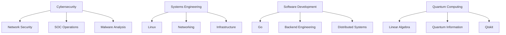

# 👋 Hey, I'm Amir Mohammad Ramezani

```text
Cybersecurity • Systems Engineering • Go Developer
Linux Enthusiast • Networking • Quantum Computing
```

> Building secure systems, networking tools, infrastructure software, and research-oriented projects.

---

## 🚀 About Me

* 🔐 Interested in Cybersecurity, SOC Operations, and Network Security
* 🐧 Linux user focused on systems administration and automation
* ⚡ Learning Go for backend and infrastructure development
* 🌐 Exploring networking, distributed systems, and self-hosting
* 🧠 Studying Quantum Computing and Quantum Information Theory
* 📚 Always learning through projects, research, and open-source contributions

---

## 🎯 Current Goals

* Build production-grade Go applications
* Deepen Linux and Networking expertise
* Contribute to open-source projects
* Develop advanced cybersecurity projects
* Pursue research opportunities in Quantum Computing
* Create a portfolio worthy of international scholarships

---

## 🔥 Featured Projects

### 🌐 MeshGate-DDNS

Self-hosted Dynamic DNS platform for homelabs and infrastructure enthusiasts.

**Stack:** Go • Docker • Redis • SQLite • REST APIs

---

### 🧮 DiscreteLab

Research-focused platform for logic computation, truth tables, and discrete mathematics visualization.

**Stack:** React • FastAPI • Python • SymPy

---

### ⚙️ Truth Table Machine

Terminal-based logic computation engine with rich visualizations and formula parsing.

**Stack:** Python • Rich • CLI Development

---

## 🛠 Tech Stack

### Languages


### Linux & Infrastructure


### Development Tools


---

## 📈 Learning Journey



---

## 📊 GitHub Stats


---

## 🏆 Achievements


---

## 📫 Connect With Me

[](https://linkedin.com/in/amram841)

---

## 💡 Philosophy

> "The obstacle is the way."
>
> — Marcus Aurelius

---


