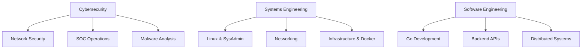

<h1 align="center">Hi, I'm Amir Mohammad Ramezani 👋</h1>

<p align="center">
  <b>Cybersecurity • Linux • Networking • Go • Systems Engineering • </b>
</p>

<p align="center">
  Building secure systems, networking tools, infrastructure software, and research-oriented projects.
</p>

<p align="center">
  <a href="https://linkedin.com/in/amram841">
    
  </a>
  <a href="https://stackoverflow.com/users/13252783">
    
  </a>
  <a href="https://github.com/AmRam841">
    
  </a>
</p>

---

## About Me

- I enjoy building things that are useful, reliable, and technically interesting.
- I spend a lot of time with Linux, networking, security .
- I am learning Go for backend, infrastructure, and systems programming.
- I like projects that solve real problems instead of just looking flashy.
- I care about clean architecture, documentation, and maintainable code.

---
## 🎯 Areas of Interest

* Cybersecurity
* Linux and Open Source Software
* Network Engineering
* Infrastructure Automation
* Self-Hosting
* Backend Development
* Distributed Systems
* Monitoring and Observability
* DevOps
* Systems Programming

---

## Featured Projects

### MeshGate
MeshGate is a self-hosted edge networking platform designed to simplify secure service exposure, dynamic DNS management, and private machine-to-machine connectivity.


### DiscreteLab
A research-oriented system for truth tables, logical formulas, Graph  visualization , Attack Lab Rsa , Rsa implemntation without using Libs , AES Production ready implementaion 

**Main stack:**  Python, PyCryptodome , Rich


## Tech Stack

### Languages


### Linux, Infrastructure, and DevOps


### Frameworks and Tools


---


## 🗺️ Learning Journey



## Core Interests

```text
Cybersecurity      ██████████
Linux Systems      ██████████
Networking         █████████░
Go Development     ███████░░░
DevOps             ██████░░░░
Distributed Systems█████░░░░░


```


## 🚀 2026 Goals

* [ ] Release MeshGate-DDNS v1.0
* [ ] Build a production-ready Go API
* [ ] Deploy a complete self-hosted homelab stack
* [ ] Learn advanced Docker networking
* [ ] Contribute to open source
* [ ] Earn a cybersecurity certification
* [ ] Publish technical write-ups and documentation


## GitHub Stats

<p align="center">
  
</p>

<p align="center">
  
</p>

<p align="center">
  
</p>

---


## 🏆 Achievements


---

## Contact

<p align="center">
  <a href="https://linkedin.com/in/amram841">
    
  </a>
  <a href="https://stackoverflow.com/users/13252783">
    
  </a>
</p>

---

## 💡 Philosophy

> "The obstacle is the way."
>
> — Marcus Aurelius

---


